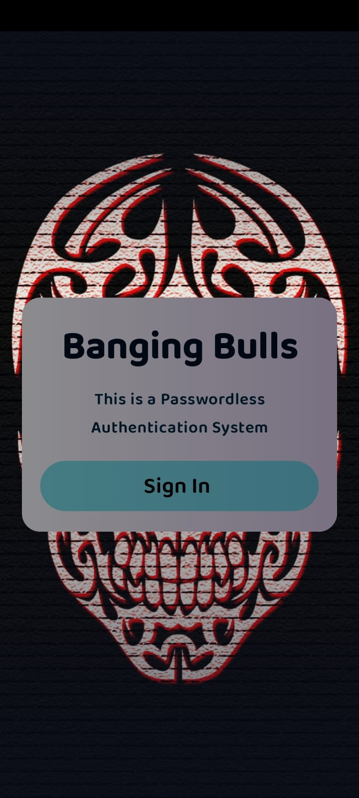
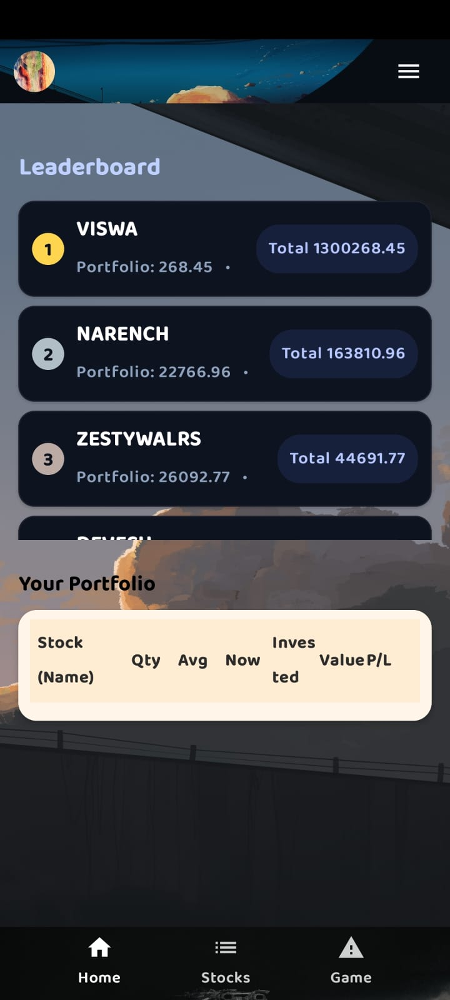
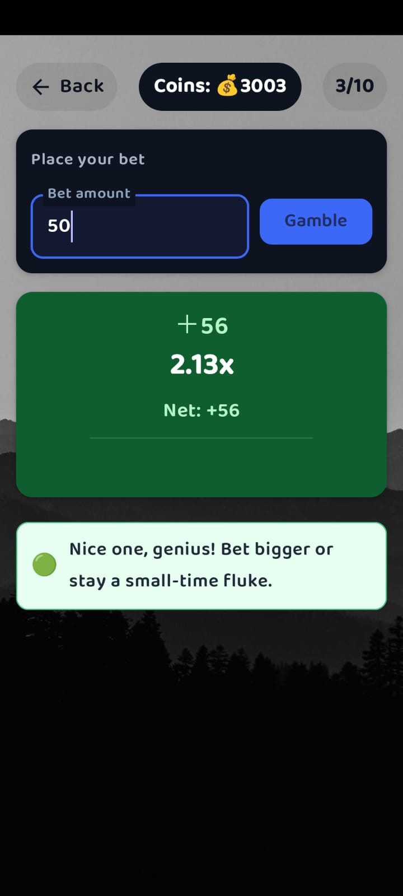
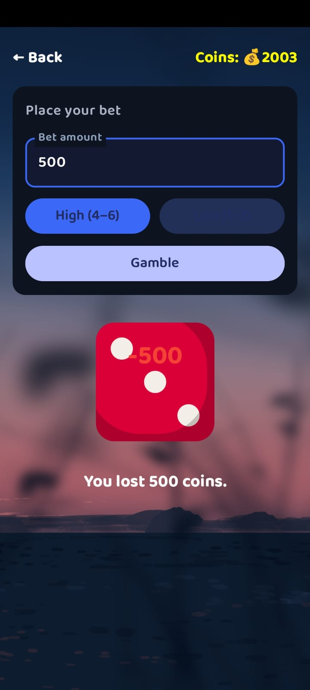
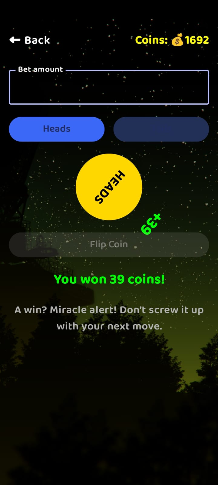
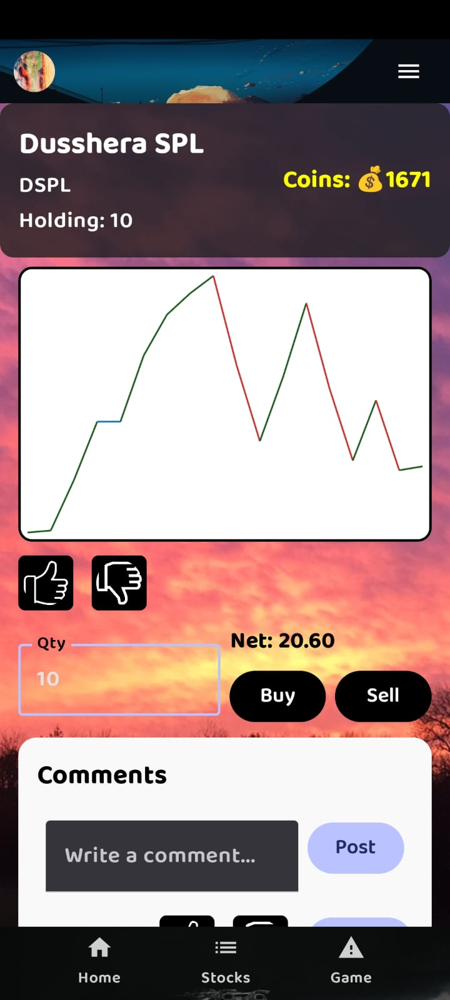

# Banging Bulls — Skill Games + Stocks Playground

Banging Bulls is an Android app that blends quick, skill‑based mini‑games with a lightweight stocks playground, wrapped in a slick, immersive UI. It features passwordless authentication, daily rewards, dynamic leaderboards, and a modern Kotlin + Jetpack Compose architecture aligned with clean MVVM patterns.

---

## Platform & Stack

- **Platform**: Android (min SDK as configured in the Gradle module)
- **Language**: Kotlin
- **UI**: Jetpack Compose, Material 3
- **Auth**: Google sign‑in via Firebase Authentication (passwordless flow)
- **Data**: Firebase Firestore (profiles, coins, game history, leaderboard, portfolio)
- **Async**: Kotlin Coroutines, Flow
- **Navigation**: Navigation Compose with animated transitions
- **Background Work**: WorkManager (periodic leaderboard refresh and future jobs)
- **Media**: Asset‑based audio (intro, coin wins, losses) with safe MediaPlayer reuse

---

## Core Experience

Banging Bulls mixes fast, skill‑based casino‑style mini‑games with a simple stocks playground backed by a virtual holdings portfolio, all designed to feel like a modern, immersive game hub. Players earn and spend in‑app coins, climb the leaderboard, and explore stock cards and a lightweight portfolio table.

### Screens Included

- **Splash**: Animated logo, loader, and intro sound
- **Auth**: Passwordless Google sign‑in with a branded background
- **Username**: First‑login username input and profile creation
- **Intro Card**: One‑time, dismissible card explaining the core concept
- **Home + Leaderboard**: Central hub with player stats, daily rewards, top players, and quick links
- **Games**:
  - Crash/Rocket (timing‑based)
  - Dice (Hi‑Lo)
  - Limbo
  - Coin Flip
- **Stocks**:
  - Stock list with compact cards
  - Stock detail view
  - Portfolio table showing virtual holdings and coin value
- **Profile**: Avatar, username edit, coins and stats, quick actions (e.g., logout, reset)

---

## Download & Demo

**Latest APK / AAB**:  
Head to the Releases section and download the latest signed build:

- [Releases → Download APK/AAB](https://github.com/chknaren6/BangingBulls/releases)

---

## Demo Media

### Images

Place the demo images in the repo under `Docs/Images/` with the following filenames:

| Screen              | Image path                      |
|---------------------|---------------------------------|
| Auth                | `Docs/Images/auth.jpeg`         |
| Username            | `Docs/Images/username.jpeg`     |
| Home + Leaderboard  | `Docs/Images/home_screen.jpeg`  |
| Game — Crash/Rocket | `Docs/Images/rocket_game.jpeg`  |
| Game — Dice         | `Docs/Images/dice_roll.jpeg`    |
| Game — Coin Flip    | `Docs/Images/coin_flip.jpeg`    |
| Game — Generic      | `Docs/Images/game_screen.jpeg`  |
| Stocks — List       | `Docs/Images/stocks_list.jpeg`  |
| Stocks — Detail     | `Docs/Images/stocks_detail.jpeg`|

Example gallery:

  
  
  
  
  
  
  

### Video

Place the demo video under `Docs/demo.mp4` and reference it from the README:

- **Demo Video**: [Docs/demo.mp4](Docs/demo.mp4)

---

## Features

### Authentication & Onboarding

- Google sign‑in powered by Firebase Authentication for a fully passwordless flow.
- Automatic routing based on whether a Firestore user profile exists and the `introSeen` flag.
- First‑time username input screen followed by a one‑time intro card; once `introSeen` is set in Firestore, the intro is never shown again.

### Immersive UI & UX

- Fully built with Jetpack Compose and Material 3 for a declarative, modern UI.
- Full‑bleed image/video‑style backgrounds, transparent overlays, and white iconography for a game‑like feel.
- Custom top and bottom bars, consistent theming across games and stocks, and smooth screen transitions via Navigation Compose.

### Mini‑Games

- **Crash/Rocket**: Timing‑based game with frame‑synchronized audio and win/loss feedback dispatched after UI state updates to avoid glitches.
- **Dice (Hi‑Lo), Limbo, Coin Flip**: Fast rounds with coin‑burst animations on wins and coin deductions on losses.
- Centralized game logic in view models and repositories handles result computation, coin updates, validations, and session flow for better testability and separation of concerns.

### Stocks Playground

- **Stocks list**: Compact cards with responsive typography, showing key stock info at a glance.
- **Stock detail**: Dedicated screen per stock with price information and contextual data.
- **Portfolio**: Cream‑themed portfolio card with a lightweight table tracking holdings and virtual coin value.

### Rewards, Limits & Background Work

- **Daily rewards**: Users can claim daily coins to keep playing games and exploring stocks.
- **Daily play limits**: Each game has a configurable plays‑per‑day limit, surfaced via countdown and remaining‑plays UI.
- **Background sync**: WorkManager runs periodic background jobs to refresh leaderboard data, keeping rankings up to date without manual refresh.

### Audio & Media

- Asset‑based audio for intro music, coin collection, and loss sounds.
- MediaPlayer is preloaded and reused with safe lifecycle handling to avoid memory leaks and audio glitches across configuration changes.

---

## Tech Stack & Architecture

Banging Bulls follows a modular, feature‑oriented structure under clean architecture and MVVM principles.

### Tech Stack

- **Language**: Kotlin
- **UI**: Jetpack Compose, Material 3
- **Async & State**: Coroutines, Flow, unidirectional data flow from repositories to UI
- **Architecture**: MVVM with per‑feature view models
- **Navigation**: Navigation Compose with animated transitions
- **Backend**:
  - Firebase Authentication (Google sign‑in)
  - Firebase Firestore (profiles, coins, game history, leaderboard, portfolio)
- **Background Work**: WorkManager (leaderboard sync and future jobs)
- **Media**: MediaPlayer with asset‑backed sounds

### Project Structure (High Level)

- `Splash/`  
  - Splash screen, animated logo, intro sound, and audio helpers.
- `Authentication/`  
  - `V/`: Auth UI screens (`Auth`, `Username`, `Intro Card`)  
  - `VM/`: Auth view models and onboarding logic.
- `Home/`  
  - Home hub UI with leaderboard, portfolio summary, and quick links into games and stocks.
- `Game/`  
  - `V/`: UI composables for Crash/Rocket, Dice (Hi‑Lo), Limbo, Coin Flip.  
  - Game session handling, result dialogs, win/lose animations.
- `Stocks/StockFiles/`  
  - `V/`: Stocks list and detail screens.  
  - `VM/`: Stocks and portfolio view models.  
  - `M/`: Firestore models and repositories for stock and portfolio data.
- `Profile/`  
  - Profile screen: avatar, username editing, coin stats, quick actions (e.g., logout/reset).
- `Navigation/`  
  - App navigation host, route definitions, and deep links.
- `UserViewModel`  
  - Central user session holder, Firestore listeners, `clearSession` logic for logout or account reset.

---

## Getting Started

### Prerequisites

- Android Studio (latest stable)
- JDK compatible with the project’s Gradle configuration
- Firebase project with:
  - Google sign‑in enabled
  - Firestore enabled
  - A configured `google-services.json` under the `app/` module

### Setup

1. **Clone the repository**  
- git clone https://github.com/chknaren6/BangingBulls.git
2. **Open in Android Studio**  
- Open the cloned project in Android Studio.
3. **Configure Firebase**  
- Download your `google-services.json` from the Firebase console.  
- Place it under the `app/` module (`app/google-services.json`).
4. **Build and run**  
- Sync Gradle and build the project.  
- Run on an Android emulator or physical device.
5. **First run flow**  
- Sign in with Google.  
- Choose a username on first login.  
- View the one‑time intro card.  
- Start playing mini‑games, earning coins, and exploring the stocks playground.

---

## Roadmap

Planned improvements and future work:

- Integrate dynamic, real‑time market data into the stocks playground instead of static or placeholder values.
- Introduce more advanced risk‑reward mechanics linking game outcomes and stock performance.
- Add richer analytics, experimentation, and A/B tests for rewards, limits, and game tuning.
- Expand the mini‑game catalog and add deeper portfolio insights, charts, and breakdowns.

---
